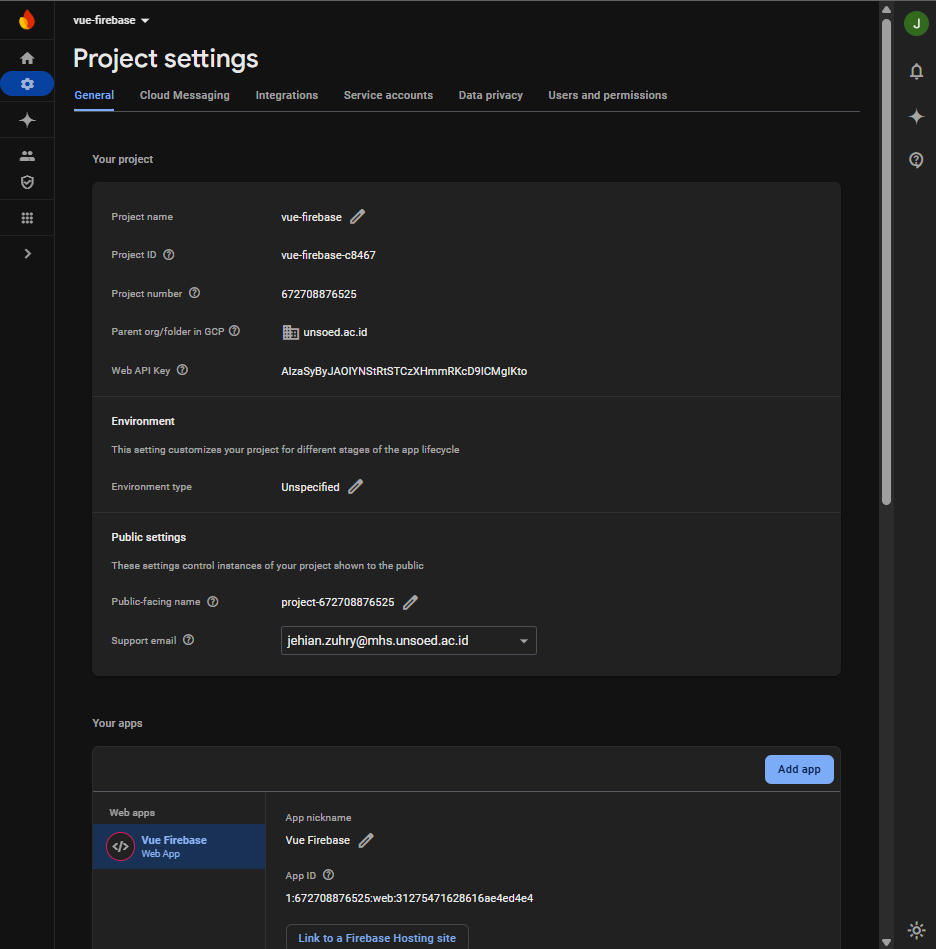
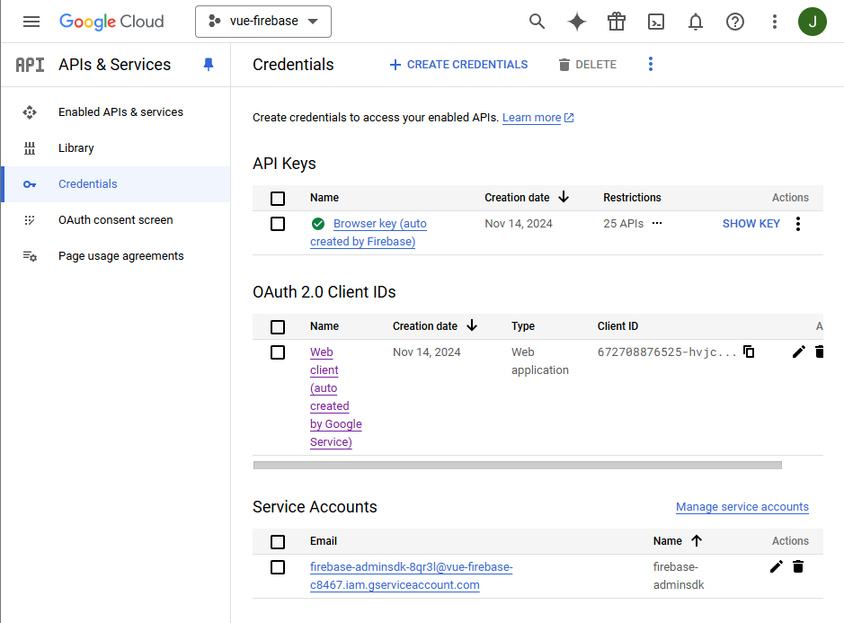
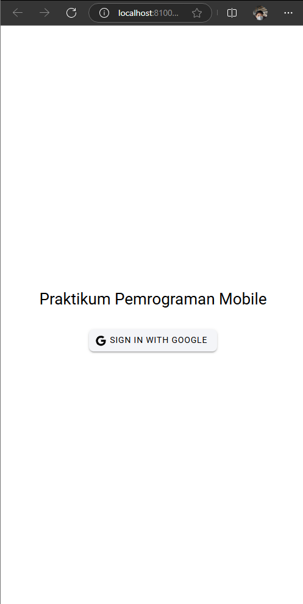
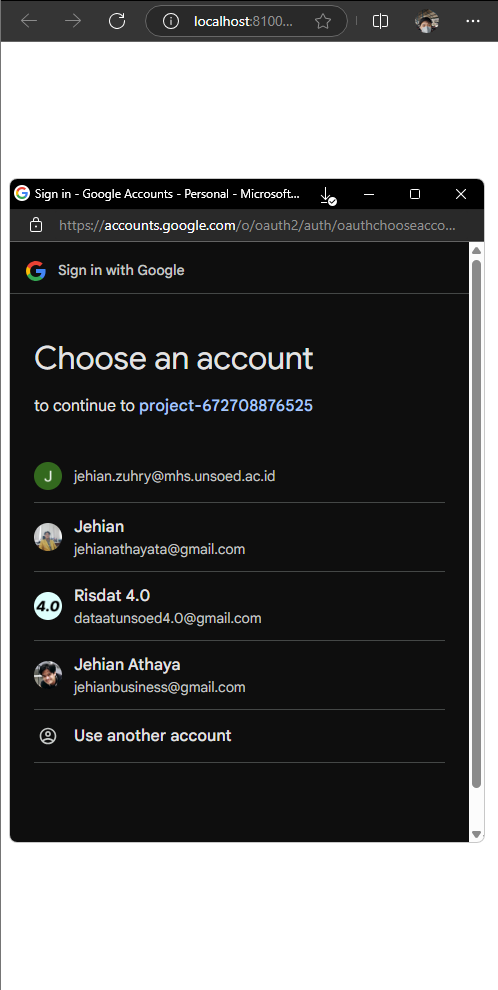
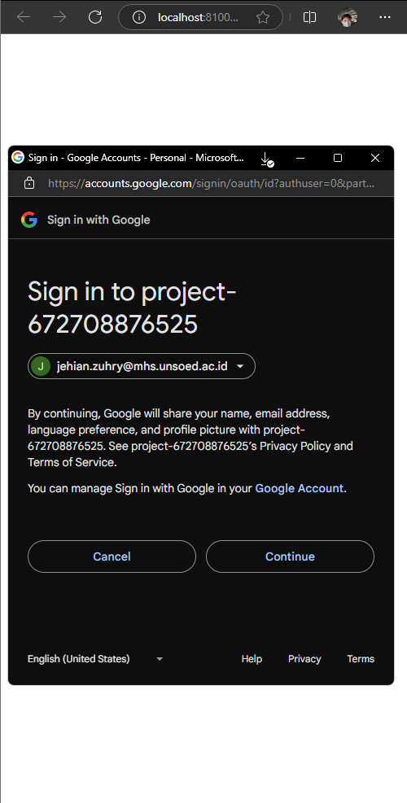
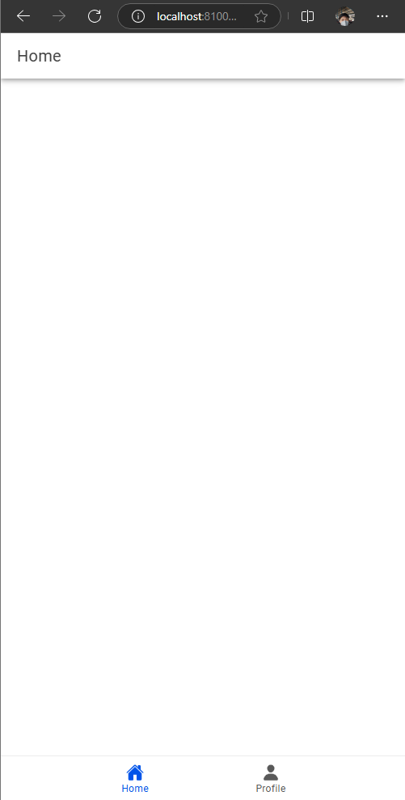
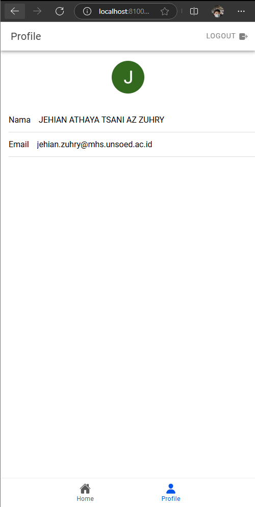
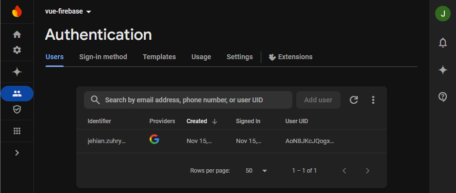

# Tugas 9 - Pertemuan 10

Jehian H1D022006 Shift C->D

# Feats

### 1. Konfigurasi Firebase Project



*Screenshot ini menunjukkan halaman pengaturan project Firebase yang berisi konfigurasi dasar seperti Project ID, Web API Key, dan informasi konfigurasi lainnya yang diperlukan untuk integrasi dengan aplikasi.*

### 2. Setup Google Cloud OAuth Client ID



*Screenshot ini memperlihatkan halaman Google Cloud Console dimana OAuth Client ID dibuat dan dikonfigurasi untuk memungkinkan autentikasi Google dalam aplikasi.*

### 3. Implementasi Login Page



*Tampilan halaman login aplikasi yang menampilkan tombol "Sign In with Google" untuk memulai proses autentikasi.*

### 4. Proses Login Google



*Popup pemilihan akun Google yang muncul ketika user menekan tombol login.*



*Konfirmasi izin akses yang diminta aplikasi ke akun Google pengguna.*

### 5. Halaman Home



*Halaman utama aplikasi setelah user berhasil login, menampilkan navigasi dan konten dasar.*

### 6. Halaman Profile



*Halaman profil yang menampilkan informasi user yang didapat dari akun Google seperti nama, email, dan foto profil.*

### 7. Firebase Authentication Users



*Panel Firebase Authentication yang menampilkan daftar user yang telah melakukan login ke aplikasi.*

## Alur Kerja Autentikasi

1. **Inisialisasi Firebase dan Google Auth**
   - Aplikasi dimulai dengan konfigurasi Firebase menggunakan credentials dari Firebase Console
   - Setup Google Auth provider dengan Client ID dari Google Cloud Console

2. **Proses Login**
   - User menekan tombol "Sign In with Google"
   - Aplikasi menginisialisasi Google Auth dengan Client ID yang telah dikonfigurasi
   - Popup pemilihan akun Google ditampilkan
   - User memilih akun dan memberikan izin
   - Token autentikasi diterima dari Google
   - Token diverifikasi oleh Firebase
   - User data disimpan di Firebase Authentication

3. **Manajemen State dan Data User**
   - Data user disimpan menggunakan Pinia store
   - Profile picture, nama, dan email diambil dari data Google account
   - State autentikasi dimonitor menggunakan `onAuthStateChanged`
   - Router guard memproteksi halaman yang membutuhkan autentikasi

4. **Implementasi Teknis**
   - Gunakan `@codetrix-studio/capacitor-google-auth` untuk handle Google Sign-In
   - Implementasi error handling untuk kasus gagal login
   - Setup router navigation guard untuk proteksi route
   - Implementasi logout function untuk membersihkan state dan redirect ke login page

## Kode Kunci

### Setup Firebase
```typescript
const firebaseConfig = {
  apiKey: "YOUR_API_KEY",
  authDomain: "YOUR_AUTH_DOMAIN",
  projectId: "YOUR_PROJECT_ID",
  // ...other config
};

const firebase = initializeApp(firebaseConfig);
const auth = getAuth(firebase);
```

### Login Implementation
```typescript
const loginWithGoogle = async () => {
  try {
    await GoogleAuth.initialize({
      clientId: "YOUR_CLIENT_ID",
      scopes: ["profile", "email"],
      grantOfflineAccess: true,
    });
    const googleUser = await GoogleAuth.signIn();
    const credential = GoogleAuthProvider.credential(
      googleUser.authentication.idToken
    );
    await signInWithCredential(auth, credential);
    router.push("/home");
  } catch (error) {
    console.error("Google sign-in error:", error);
    // Handle error
  }
};
```

## Troubleshooting

1. **Client ID Tidak Valid**
   - Pastikan Client ID yang digunakan sesuai dengan yang ada di Google Cloud Console
   - Verifikasi Authorized JavaScript origins sudah mencakup URL aplikasi

2. **Popup Blocked**
   - Pastikan browser tidak memblokir popup untuk domain aplikasi
   - Handle kasus popup blocked dalam code dengan proper error message

3. **Token Expired**
   - Implementasi refresh token logic
   - Handle kasus auto-logout ketika token expired

4. **CORS Issues**
   - Pastikan domain aplikasi terdaftar di Firebase Console
   - Verifikasi setting di Google Cloud Console