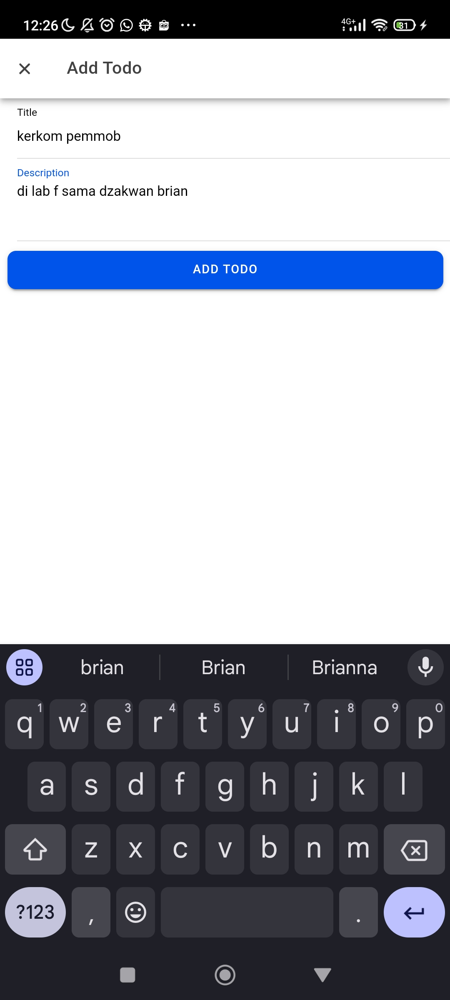
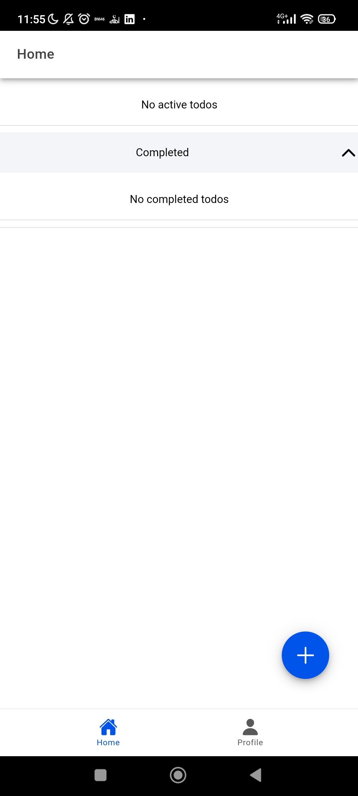
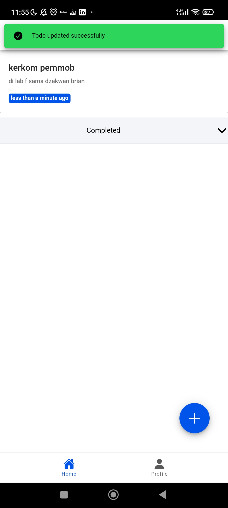
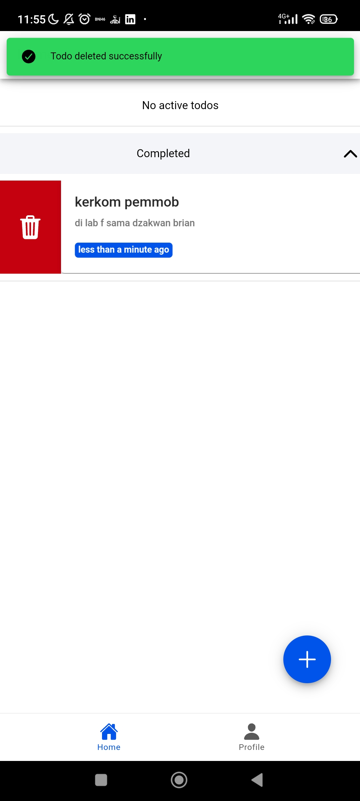
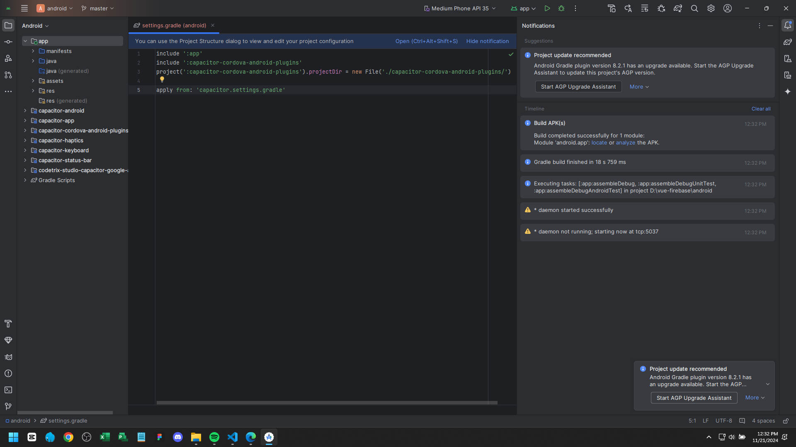
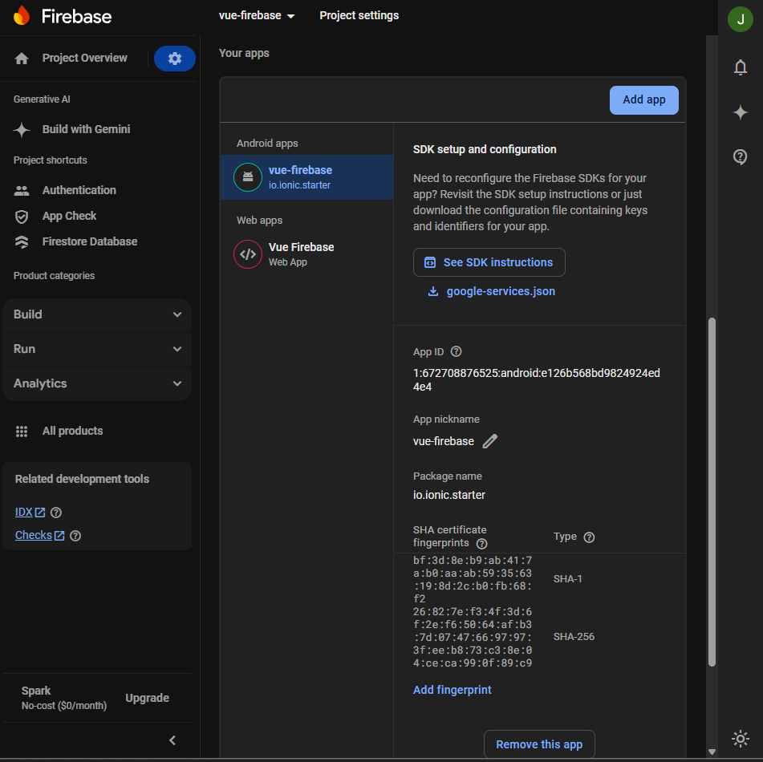

# Tugas 9 - Pertemuan 10

Jehian H1D022006 Shift C->D

# Feats

### 1. Create Todo



Fitur menambahkan todo baru dengan input title dan description. Klik tombol "+" di pojok kanan bawah untuk membuka modal input. Setelah mengisi, tekan tombol "Add Todo" untuk menyimpan ke Firestore.

### 2. Read Todo



Daftar todo ditampilkan dengan dua section: Active Todos dan Completed Todos. Setiap todo menampilkan:
- Title
- Description
- Relative time (e.g., "2 hours ago")
- Status (active/completed)

### 3. Update Todo



Edit todo dengan cara:
- Geser todo ke kanan dan klik ikon pensil
- Modal edit akan terbuka dengan data todo yang dipilih
- Ubah title atau description
- Tekan tombol "Edit Todo" untuk menyimpan perubahan

### 4. Delete Todo



Menghapus todo dengan dua cara:
- Geser todo ke kiri dan klik ikon tempat sampah
- Konfirmasi penghapusan akan muncul
- Todo akan langsung dihapus dari Firestore

### 5. Toggle Todo Status


Ubah status todo:
- Geser todo ke kanan dan klik centang untuk mengubah status
- Todo akan berpindah antara Active dan Completed
- Status tersimpan di Firestore dengan timestamp update

## Membangun APK dengan Ionic

### Prasyarat
- Java Development Kit (JDK) 17 (Jetbrains vendor)
- Node.js dan npm
- Ionic CLI
- Android Studio
- Capacitor

### Langkah-langkah Build APK

1. Pastikan Dependensi Terinstal
```bash
npm install -g @ionic/cli
npm install
```

2. Tambahkan Platform Android
```bash
ionic cap add android
```

3. Build Proyek Ionic
```bash
ionic build
```

4. Sync Proyek dengan Capacitor
```bash
ionic cap sync android
```

5. Buka Proyek di Android Studio
```bash
ionic cap open android
```

6. Generate Signed APK
- Buka "Build" > "Generate Signed Bundle / APK"
- Pilih "APK"
- Buat Keystore baru atau gunakan yang sudah ada
- Pilih release configuration
- APK akan tersimpan di `android/app/build/outputs/apk/release/`

### Screenshot Proses Build



*Proses generate signed APK di Android Studio*

## Konfigurasi Firebase untuk Android

### Tambahkan SHA Certificate Fingerprints

1. Generate SHA-1 dan SHA-256
```bash
keytool -list -v -keystore ~/.android/debug.keystore
```

2. Di Firebase Console
- Masuk ke Project Settings
- Pilih tab "Your apps"
- Klik "Add app" dan pilih Android
- Sesuaikan Package Name dengan file `capacitor.config.ts`
- Tambahkan SHA-1 dan SHA-256 certificate fingerprints

### Screenshot Konfigurasi



*Tambahkan SHA fingerprints di Firebase Console*